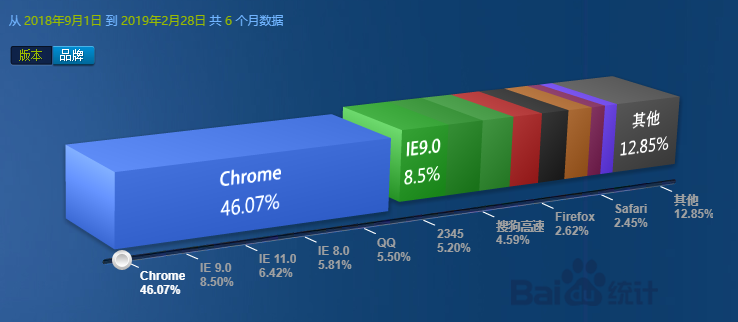
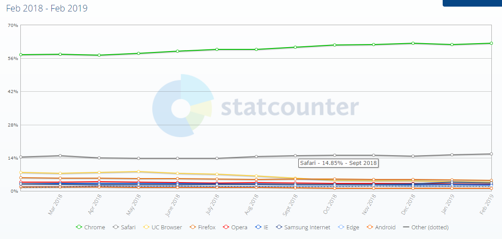
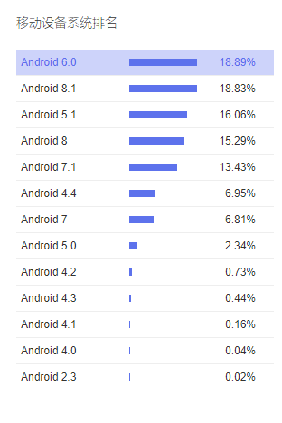
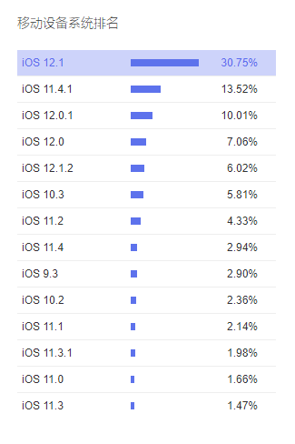

# 浏览器兼容规范

> TODO: 文档待完善

> 2019年

## 浏览器/平台分布情况

### PC 平台

不管在国际范围还是国内，Chrome都占主要地位，但是需要考虑部分IE用户

### 移动平台

Android平台6.0 以上占大约73%

iOS平台分布情况较为比较理想，能够支持大部分的前端特性

### 浏览器平台/发布年份

| 年份 | Android | Chrome | Safari | Firefox | IE |
|-----|----|----|---|----|---|
| 2018 | 9.0 |64 - 71 |12(对应iOS12) |58 - 64 | |
| 2017 | 8.0 - 8.1 |56 - 63| 11 | 51 - 57 | |
| 2016 | 7.0- 7.12  |48 - 55| 10 | 44 - 50 | |
| 2015 | 6.0 | 40 - 47| 9 | 35 - 43 | |
| 2014 | 5.0 - 5.1  | 32 - 39| 8 | 27 - 34 | |
| 2013 | 4.4 | |  | | 11 |
| 2012 | ||  | | 10 |
| 2012 | ||  | | 9 |

### GZB实际使用情况

暂无数据

## 规范

### 定义兼容级别

+ 完全兼容： 保证百分百功能正常
+ 部分兼容: 只能保证功能、样式与需求大致一致。对于一些不影响主体需求和功能的bug，会做降低优先级处理或者不处理。
+ 不兼容: 不考虑兼容性

### 管理系统

管理系统指的是公司内部使用或者面向管理人员的中后台系统。这部分使用人群数量较少，且基本是企业内部员工，容易要求他们使用指定版本浏览器，所以要求是最低的。 针对该类应用的兼容性规范为:

+ 完全兼容: Chrome49+, Firefox44+, 也就是2016年之后发布的版本
+ 部分兼容: Chrome28+, Firefox37+, IE11. 如果客户要求，会对这部分浏览器进行兼容, 例如面向企业员工的管理系统
+ 不兼容：其他

> 版本号定义: 比如Chrome49+, 表示包含49 以及49以上版本

### 应用

应用是在工作宝客户端下运行的，算是一个可控的运行环境，对于应用的最低兼容版本会和客户端最低兼容版本保持同步：

| 客户端类型 | 客户端最低兼容版本 | 浏览器完全兼容版本 | 浏览器部分兼容版本 |
|-----------|------------------|-------------------|-------------------|
| Windows   | 不关联(Window使用内嵌Chrome浏览器, 且会定期更新), 内核版本在55(基于GZB_6.X)以上| Chrome55+ | N/A |
| Android | 5.0+ | Chrome 49+ | Chrome39+ |
| iOS | 10+ | | 10+ | N/A |

取其短板，对于应用的兼容性规范为：

+ 完全兼容： Chrome49+
+ 部分兼容： Chrome39+

### 对外页面，如官网

对于这类开放给外部的应用，使用人群难以估计，需要充分考虑上述的浏览器分布情况统计。但是为了开发效率和用户体验，我们会选择放弃老旧的浏览器。 根据统计数据，对外页面的兼容性规范如下:

+ 完全兼容: Chrome44+, Firefox35+, 微信webview，工作宝webview
+ 部分兼容: QQ浏览器， 百度浏览器，搜狗浏览器， 360浏览器（IE兼容模式）， IE10
+ 不兼容: IE9及以下

### 前端统计平台

TODO:

### polyfill

TODO:

### 兼容性测试环境

TODO:

## 统计数据来源

+ [百度流量研究院](http://tongji.baidu.com/data/browser)：主要提供国内浏览器统计
+ [statcounter](http://gs.statcounter.com/): 国际浏览器统计
+ [浏览器发布年份统计](https://en.wikipedia.org/wiki/Timeline_of_web_browsers)