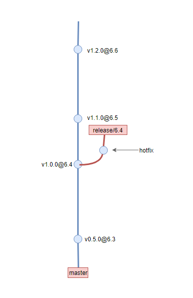
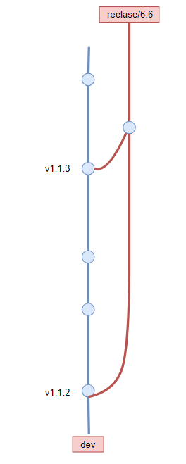

# 开发工作流规范(基于Git)

<!-- TOC -->

- [开发工作流规范(基于Git)](#开发工作流规范基于git)
  - [开发](#开发)
    - [版本规范](#版本规范)
    - [Git 分支模型](#git-分支模型)
      - [master分支](#master分支)
      - [dev分支](#dev分支)
      - [feature分支](#feature分支)
      - [preview分支](#preview分支)
      - [release分支](#release分支)
      - [git flow 风格的release分支](#git-flow-风格的release分支)
      - [自定义风格release分支](#自定义风格release分支)
    - [提交信息规范](#提交信息规范)
      - [格式](#格式)
        - [header](#header)
        - [body](#body)
        - [footer](#footer)
        - [模板和示例](#模板和示例)
    - [如何处理定制化需求](#如何处理定制化需求)
  - [发布工作流](#发布工作流)
  - [持续集成](#持续集成)
    - [持续集成阶段](#持续集成阶段)
    - [版本类型](#版本类型)
    - [交付](#交付)
      - [why](#why)
      - [方法](#方法)
        - [前端](#前端)
        - [后端](#后端)
      - [其他参考方案](#其他参考方案)
    - [模板](#模板)
  - [扩展](#扩展)

<!-- /TOC -->

## 开发

### 版本规范

前端项目使用[语义化版本](https://semver.org/lang/zh-CN/)进行发布:

版本格式：主版本号.次版本号.修订号，版本号递增规则如下：

1. 主版本号：当你做了不兼容的 API 修改，
2. 次版本号：当你做了向下兼容的功能性新增，
3. 修订号：当你做了向下兼容的问题修正。

先行版本号及版本编译元数据可以加到“主版本号.次版本号.修订号”的后面，作为延伸。

---

### Git 分支模型

#### master分支

master分支表示一个稳定的发布版本. 对应GZB的大版本.  

+ 场景: 前端应用会跟随工作宝版本迭代, 在dev分支测试稳定后, 会合并到master分支, 并使用tag标记应用版本和对应的工作宝版本
+ tag规范: `v{APP_version}@{GZB_version}`, 例如v0.1.0@GZB_6.6
+ 人员: 由项目负责人进行审核合并, 普通开发者没有权限

#### dev分支

开发者主要工作的分支, 最新的特性或bug修复都会提交到这个分支. 开发者如果在该分支进行了提交，在push到远程之前应该先pull一下， 并尽量使用rebase模式，保证分支的简洁

+ 命名规范: dev
+ tag规范: 在dev分支中也可能会经历发布过程, 例如bug修复版本. 这里同样使用tag来标记这些发布. 例如v0.1.1

#### feature分支

涉及多人协作或者大功能的开发, 应该从dev分支checkout出独立的feature分支, 避免干扰dev分支

+ 场景:
  - 涉及多人协作: 团队多个成员在同一个项目下负责开发不同的功能, 这时候每个成员在自己的feature分支独立开发
  - 大功能开发: 大功能开发跨越周期比较长, 需要多次迭代才会稳定. 这时候应该在独立的分支上开发. 方便跟踪历史记录, 也免于干扰dev分支的迭代和发布

+ 命名规范
  - feature/name: name是功能名称
  - feature/GZB_version:  这也是团队常见的模式, 当无法使用一个功能名称来描述时, 可以使用GZB版本号作为’功能’
+ 合并时机
  1. 当feature分支迭代稳定, 并通过测试后, 合并到dev分支. 合并到dev后, **feature分支的生命周期就结束了**. 后续bug修复和功能优化直接在dev开发
  2. 当多个feature分支需要合并对外发布临时版本时. 合并到preview分支 . ⚠️这种情况不应该合并到dev分支, 因为feature分支可能还不稳定或未完成. 比如为了联调某些功能.
+ 合并方式
  - 不要使用fast-forward. 这样可以在分支图上查看到分支历史
  
#### preview分支

临时的预览分支, preview分支用于临时合并feature分支, 这其中可能会修复某些bug或者冲突. 可以选择性地将这些提交cherrypick回feature分支. 当预览结束后就可以销毁preview分支

#### release分支

release分支有两种使用策略，第一种遵循`gitFlow`流程, 第二种是目前后端团队使用的策略，为了配合后端工作，我们主要使用第二种

#### git flow 风格的release分支

当前前端应用的稳定版本和GZB版本绑定. release分支不一定存在, 一般情况下, 只会在前端版本稳定后, 将其合并到master, 并创建tag标记. 而只有需要为指定的正式版本修复bug时才会创建release分支



+ 场景: 需要为某个正式版本修复bug(hotFix)时, 从master的对应tag中checkout release分支
+ 命名规范: `release/{GZB_version}` 外部人员只会关注GZB版本
+ 如何修复
  - 如果对应bug可以在dev分支直接被修复, 可以先提交到dev分支(或者已经修复了), 然后再cherrypick到release分支
  - 如果bug在新版本无法复现. 比如新版本升级了依赖. 那么在release分支直接修复即可

#### 自定义风格release分支



当要发布一个工作宝对应的版本时（或者一开始开发时）从dev分支checkout出一个开发分支，后续需要对外发布时，将dev分支合并到release分支, 并打上版本tag. 后面会介绍到后端开发和自动交付机制这种分支模式。

这一种使用策略. gzb后端在使用, 为了配合后端工作, 我们也推荐使用这种方式

- 何时创建:
  - 开启GZB新版本开发任务时(推荐)
  - 向外发布第一个版本时
- 何时合并：后面dev有版本发布都要合并到release分支，直到开启另一条release分支
- 好处
  - 对发布内容进行筛选
  - 专门用于发布, 开发者容易过滤变更的内容

---

### 提交信息规范
一个好的提交信息, 会帮助你提高项目的整体质量. 

- why
  - 格式统一的提交信息可以帮助自动化生成changelog
  - 版本库不只是存放代码的仓库, 也记录项目的开发记录. 这些记录应该可以帮助后来者快速地学习和回顾代码. 也应该方便其他协作者review你的代码
- 原则: 半年后, 你能看懂你的commit做了什么东西
- 方式: 使用git commit(打开编辑器)而不是git commit -m
- 必要信息
  - 为什么进行这次提交?
      - 提交改变了什么, 让其他reviewer更容易审核代码和忽略无关的改变
  - 如何解决的问题?
    - 问题是什么导致的？
    - 简短说明使用什么方式, 策略, 修复了问题.
  - 变化可能影响哪些地方
    - 说明变动功能的细节。 一个提交不应该做超过2个功能的变动

#### 格式

我们采用angular的提交规范, 在这个规范的基础上支持(可选)`emoji`进行修饰

```shell
<type>(<scope>): <subject>

<body>

<footer>
```

##### header

> 如果提交时feature或者fix(已发布的版本), 这些提交信息应该出现在CHANGELOG

- type: 说明commit的类别. 可以配合emoji使用, 让阅读者更快地区分提交的类型,允许以下类型:
  - ✨feature或feat: 引入新功能
  - 🐛fix: 修复了bug
  - 📝docs: 文档
  - 🎨style: 优化项目结构或者代码格式
  - ♻️refactor: 代码重构. 代码重构不涉及新功能和bug修复. 不应该影响原有功能, 包括对外暴露的接口
  - ✅test: 增加测试
  - ⏫chore: 构建过程, 辅助工具升级. 如升级依赖, 升级构建工具
  - ⚡️perf: 性能优化
  - ⏪ revert: revert之前的commit
      - git revert 命令用于撤销之前的一个提交, 并在为这个撤销操作生成一个提交
  - 🎉 build或release: 构建或发布版本
  - 🔒 safe: 修复安全问题
- scope: 可选. 说明提交影响的范围. 例如样式, 后端接口, 逻辑层等等
- Subject: 提交目的的简短描述, 动词开头,  不超过80个字符. 不要为了提交而提交

##### body

可选. 对本次提交的详细描述. 如果变动很简单, 可以省略

##### footer

可选. 只用于说明不兼容变动(break change)和关闭 Issue(如果使用使用gitlab或github管理bug的话)

##### 模板和示例

```
# 50-character subject line  
#  
# 72-character wrapped longer description. This should answer:  
#  
# * Why was this change necessary?  
# * How does it address the problem?  
# * Are there any side effects?  
#  
# Include a link to the ticket, if any.
```

参考[vue](https://github.com/vuejs/vue/commits/dev), [angular](https://github.com/angular/angular/commits/master)等开源库项目的提交

---

### 如何处理定制化需求

- 痛点
  - 对于定制化需求, 并不会引入到正规的代码流中, 一般情况下会checkout出一个分支, 来专门做这里定制化需求, 然后单独发版. 使用分支模式的缺点有:
    - 更新问题
      - 每次正规代码更新都要合并到该分支. 当分支较多时分支图就会比较混乱
      - 正规代码合并是必然会带来风险的, 比如项目结构变动, 依赖库变动. 都可能导致定制化的代码失效
- 解决办法
  - 减少代码耦合
    - 尽量将定制化需求模块化, 最小化和正规代码之间的接触面. 这是解决该问题最根本的方式.
      -  检验方式是结构变化时, 没有或很少适配代码
  - 考虑通过代码层面区分
    - 例如通过权限系统来配置. 通过后端接口动态配置
  - 优先使用fork模式
    - 有些场景确实无法通过代码层面解决, 比如ios应用定制启动图, icon, 应用名称, 外观等等. 这种方式优先使用fork模式, fork模式和分支模式没本质区别, 但是至少可以避免干扰正规开发流程

---

## 发布工作流
- 流程
  1. 进行代码变更
  2. 提交这些变更, 进行CI让这些变更通过测试
       - 如果没通过就打tag, 一旦出现测试失败, tag就得重新打
  3. 提升package.json的版本号, 更新CHANGELOG.md
  4. 打上tag, 提交
  5. 可选. 合并到release分支
- 工具
  - 使用[jm-deploy release](https://github.com/carney520/jm-deploy)自动化发布并生成CHANGELOG.md

--- 

## 持续集成

前端项目基于公司内部部署的gitlab-ci来进行持续部署。包含以下阶段(stage):

### 持续集成阶段

- 检查： 包括单元测试和代码lint。
  - 所有push到版本库的代码都会跑这个阶段. 可以在提交title中包含`[ci skip]`来跳过这个阶段
- 构建: 对前端项目进行构建. 
  - 只有打上版本tag的提交或release分支会跑构建任务
- 发布: 将前端的构建结果进行交付/发布
  - 只有打上版本tag的提交或者release分支会跑发布任务. 详见[jm-deploy](https://github.com/carney520/jm-deploy)

### 版本类型

根据交付或部署的环境， 可以分为以下类型：

- preview: 临时版本. 用于预览和调试. 主要在联调环境使用. 形式为:
  - `v{VERSION}-preview`
- test 可交付版本. 这个版本用于交付到stage或者测试环境.  形式为:
  - `v{VERSION}`
- production 生产版本. 表示实际部署到生产环境的版本. 如果test版本测试通过, 就会成为生产版本. 这个过程是通过将dev分支合并到master分支时实现的. 形式为:
  - `v{VERSION}@{GZB_VERSION}`

> 在实际开发中，可能不会严格区分这些版本，而是项目一开始就会有一个release分支，在这个release分支里进行发布

### 交付

目前前端资源是跟随后端Jar/War包一起部署的，通过将构建结果推送到一个’git发布版本库’的形式实现.

#### why

由于公司ToB业务. 部署环境差异较大, 也有可能无法连接外网. 所以没有统一/独立的部署方式和伺服服务器, 更没有CDN. 这要求我们的项目是可以独立部署, 自包含的. 前端项目不能独立存在和运行, 而是内嵌到后端项目中. 由对应后端项目来管理和伺服静态资源

#### 方法

##### 前端

发布版本库根据前面的版本类型可以划分为两种类型的分支
- 开发分支
  - preview和test总是线性迭代的, 对于这个类型的发布总会推送到开发分支. 后端开发者可以通过这个分支获取到最新的可交付代码
  - 命名
    - master, 直接使用master
- 发布分支
    - 对于production, 会为每个release版本创建一个分支, 后续该release版本的hotFix都会提交到该分支
  - 命名
    - release/{GZB_version}

对于跨项目的情况处理起来相对复杂. 因为各个项目之间版本不是同步的. 解决办法是：

- 项目之间通过目录区分和隔离
  - 例如gzb-location 会推送到部署目录下的location目录
- release分支从最新的开发分支中checkout出来. 这样可以保证拉取到其他未更新的项目

详细参考[jm-deploy](https://github.com/carney520/jm-deploy)

##### 后端

后端项目使用git submodule的方式关联前端的发布版本库. 这也意味着, 如果发布版本库有变动, 后端开发人员需要手动更新submodule到指定提交记录. 

> 有没有更好的方式? 还如容易出现错误. 可以通过git hook自动更新submodule. 检查代码当前分支是否是发布分支, 确定拉取发布分支还是开发分支(表示最新版本). 如果未找到对应发布分支, 则回退拉取开发分支

好处
  - 使用git版本库的方式可以记录发布记录
  - 方便后端本地开发, 直接可以通过git工具拉取前端代码
  - 方便人工干预

#### 其他参考方案

- 使用npm管理前端发布 + HTTP下载
- 本地文件系统维护

### 模板

gitlab-ci通过定义在根目录下的`gitlab-ci.yml`进行定义， 详见[gitlab文档](https://about.gitlab.com/product/continuous-integration/)

```yaml
before_script:
  - echo "[GZB front-end CI]"
  - nvm install 10
  - npm i -g yarn
  - yarn

cache:
  key: 'ALWAYS'
  paths:
    - node_modules/
    - dist/

stages:
  - test
  - build
  - deploy

.common: &common
  tags:
    - node

.release_ref: &release_ref
  - /^release\/.*$/ # release 分支
  - /^v\d+\.\d+\.\d+.*$/ # release tag

# 单元测试
test:
  <<: *common
  stage: test
  script: echo "No tests yet"
  # 避免被触发两次
  except:
    - /^v\d+\.\d+\.\d+.*$/ # release tag

# 构建
build:
  <<: *common
  stage: build
  script: yarn build --cache-by-npm-version
  only: *release_ref
  artifacts:
    paths:
      - dist/
    expire_in: 1 week

# 部署前端资源
deploy:
  <<: *common
  stage: deploy
  script: yarn deploy
  only: *release_ref
```

## 扩展

- [如何写好 Git commit log?](https://www.zhihu.com/question/21209619)
- [提交信息emoji规范](https://gitmoji.carloscuesta.me)
- [Commit message 和 Change log 编写指南](http://www.ruanyifeng.com/blog/2016/01/commit_message_change_log.html)
- [Git远程操作详解](http://www.ruanyifeng.com/blog/2014/06/git_remote.html)
- [git钩子定制团队代码提交流程规范](https://www.jianshu.com/p/527e34f53b51)
- [保持fork之后的项目和上游同步](https://github.com/staticblog/wiki/wiki/%E4%BF%9D%E6%8C%81fork%E4%B9%8B%E5%90%8E%E7%9A%84%E9%A1%B9%E7%9B%AE%E5%92%8C%E4%B8%8A%E6%B8%B8%E5%90%8C%E6%AD%A5)

